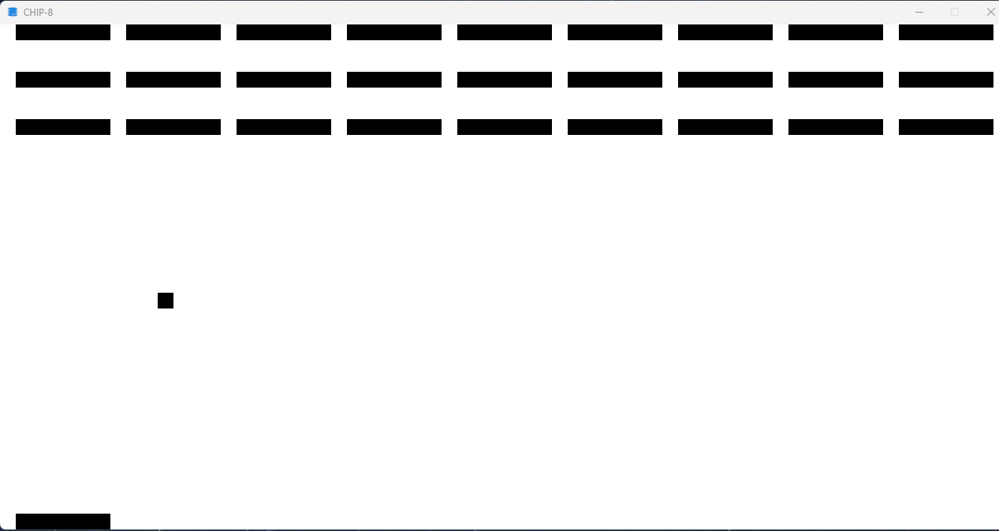

# CHIP-8

> **NOTE**: 🚧 Under active development. 🚧
Simple [CHIP-8](https://en.wikipedia.org/wiki/CHIP-8) emulator written in C, with a custom assembly language.

## Table of Contents

* [Dependencies](#dependencies)
* [License](#license)

## Dependencies

The emulator has the following dependencies

* [SDL 2.0](https://github.com/libsdl-org/SDL) a cross-platform development library designed to provide low level access to audio, keyboard, mouse, joystick, and graphics hardware.

## License

This project is licensed under the [GNU General Public License](LICENSE)
